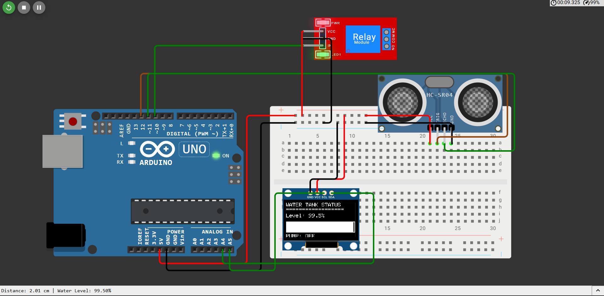

# Intelligent Water Tank Monitor

**A simple Arduino-based system that monitors water level in a tank and controls a pump to prevent overflow.**

## Components Required

- Arduino Uno/Nano
- HC-SR04 Ultrasonic Sensor
- 0.96" OLED Display (SSD1306, I2C)
- 5V Relay Module
- 12V Water Pump (optional, for demonstration)
- Breadboard and jumper wires
- Water tank (any container)

## Wiring Diagram

| Component                   | Arduino Connection    |
| --------------------------- | --------------------- |
| **Ultrasonic Sensor** |                       |
| VCC                         | 5V                    |
| GND                         | GND                   |
| Trig                        | D12                   |
| Echo                        | D11                   |
| **OLED Display**      |                       |
| VCC                         | 3.3V or 5V            |
| GND                         | GND                   |
| SDA                         | A4 (Uno) / SDA (Nano) |
| SCL                         | A5 (Uno) / SCL (Nano) |
| **Relay Module**      |                       |
| VCC                         | 5V                    |
| GND                         | GND                   |
| IN                          | D10                   |

## Features

- Real-time water level display (0-100%)
- Visual progress bar on OLED
- Automatic pump control:
  - Turns pump ON when water level < 30%
  - Turns pump OFF when water level > 80%
- Overflow warning at 95% level
- Serial monitor output for debugging

## Calibration

1. Measure your tank's exact height and diameter
2. Adjust `TANK_HEIGHT_CM` constant in code to match your tank height
3. Position sensor at the top of the tank, pointing downward
4. Test with different water levels to verify accuracy

## How It Works

1. **Distance Measurement**: Ultrasonic sensor measures distance from sensor to water surface
2. **Water Level Calculation**: `Level = (Tank Height - Distance) / Tank Height × 100`
3. **Display**: OLED shows current level and pump status
4. **Pump Control**: Relay turns pump on/off based on water level thresholds

## Usage

1. Upload the sketch to your Arduino
2. Connect components according to the wiring diagram
3. Power on the Arduino
4. Monitor water level on OLED and Serial Monitor
5. Pump will automatically turn on/off based on water level

## Troubleshooting

- **OLED not displaying**: Check I2C connections (SDA/SCL) and power
- **Inconsistent readings**: Ensure sensor is clean and not obstructed
- **Pump not activating**: Verify relay module connections and relay settings
- **Distance always 0**: Check sensor connections and ensure proper trigger pulse

## License

MIT License - feel free to use and modify for your own projects
